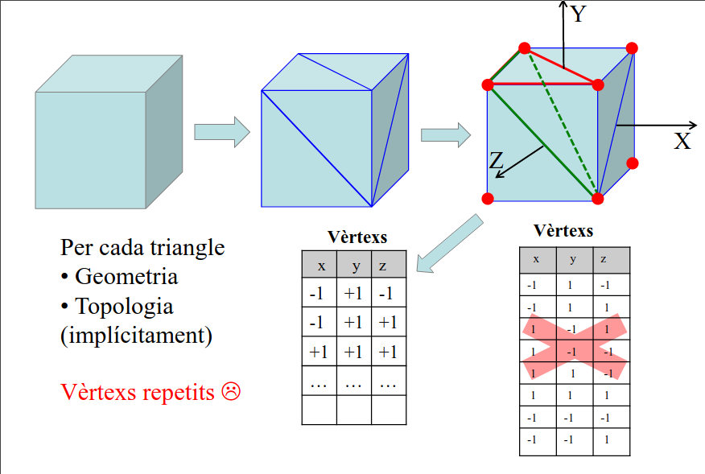
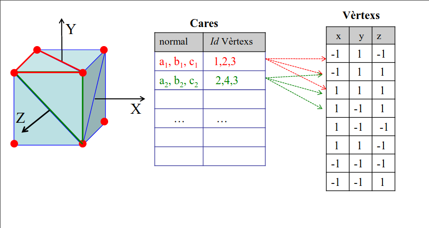
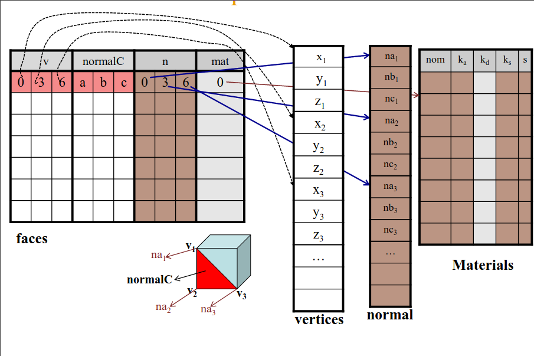
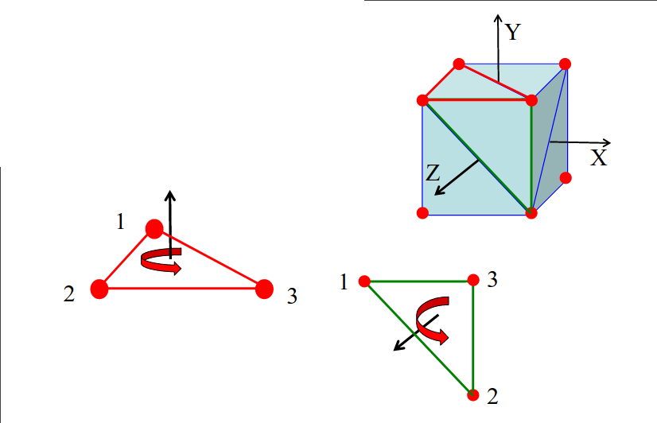
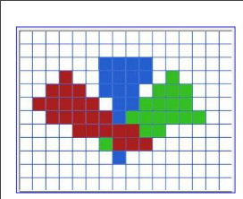

# IDI

## Introducción

Se convierte la superficie en triángulos para el renderizado. El eje solo puede
ser la unión de dos triángulos y los vértices se tienen que colocar de forma
que no quedan agujeros.

La visualización del modelo se realiza a partir de una cámara en el proceso de
visualización que se ejecuta en la GPU todo en paralelo. Toda la visualización
se realida usando `OpenGL 3.3`.

### Modelos geométricos

Solo trabajaremos con modelos sólidos y de fronteras.

Los triángulos se guardan a partir de un sistema de cordenadas, guardando las
coordenadas en el sistema de los tres puntos.

Ejemplo: convertir un cubo

Se divide la superficie en triángulos a partir de diferentes sistemas:

- Se guardan los vértices en orden de forma que cada conjunto de 3 representa
  un triángulo. (Topología implicita)
	
  

  El problema de este sistema es que es ineficiente al repetirse muchos
  vértices en la tabla de datos.

- Otro modelo posible se basa en guardar los índices sin repetirlos en una
  tabla y después tener otra tabla más para cada triángulo que apunta al índice
  de cada vértice en la tabla de vértices. (Topología explícita)

  

**Importante**: Los vértices tienen que guardarse en la tabla en sentido
antihorario de forma que la normal apuntará hacia afuera porque OpenGL usa la
normal para determinar si el triángulo apunta hacia adentro o afuera, de forma
que solo se renderiza aquellos que está afuera acelerando este proceso. Además
al momento de hacer la iluminación es necesario ver si la normal del triángulo
apunta a la luz de forma que se puede identificar si se usa o no.

### Estructura de datos

Contiene los identificadores de los vértices, la normal de la cara, la normal
de los vértices (sirve para cuestiones de iluminación) y el índice del
material que se usa para el renderizado.

### Ficheros

Los ficheros de los modelos se guardan en `.obj` y en un `.mtl` la información
del material.

### Comprobación de la correctitud de un modelo

- Las caras tienen que estar orientadas.
- Los vértices tienen que estar ordenados de forma coherente con la orientación
  de las caras.
  
- Cada arista tiene que separar 2 caras.
- No hay agujeros en la malla.

### Uso de OpenGL

El programa se divide en operaciones entre CPU y GPU, siendo la CPU donde se
guardan los datos y se procesan y en la GPU se realiza la visualización de
estos datos.

El proceso de visualización realiza varias transformaciones en los datos que
recibe para poder renderizar.

El modelo solo se envía una vez a la GPU a través de un sistema de topología
implícita. En la GPU se crea un VAO que se encarga de encapsular los datos del
modelo en un VBO para vértices, otro para colores, otro para normales, etc.

En cambio, cada vez que se requiera pintar el modelo en pantalla se tendrá que
llamar a la función designada para eso.

#### Proceso de renderizado

1. Se crean y llenan VAO y VBO
2. Se pasan a la GPU
3. Se pintan los modelos

El problema es que pueden haber colisiones con los sistemas de coordenadas, de
forma que puede suceder una colisión que no se quiere y debe corregirse con una
transformación geométrica.

La transformación del sistema de coordenadas del modelo se puede realizar antes
del paso de los datos pero requiere mucho más procesamiento por cada
transformación. La otra opción es guardar la geometría una única vez en la GPU
y la transformación se realiza en la función de pintado.

A la hora de pintar los modelos se crean las estructuras de datos de cada
modelo, se añade al buffer de renderizado el modelo con la transformación que
tenga y finalmente se pinta.

### Salida

Hay gran variedad de dispositivos y tecnología de salida. Nos centraremos en
las pantallas.

Las pantallas tienen una resolución determinada (cantidad de píxeles) que nos
da un sistema de coordenadas. Para cada canal de color en el sistema RGB se usa
una representación de 8 bits para cada color.

Se determina el dato en OpenGL a partir de fragmentos que además de la
información del color contiene más datos como la profundidad de forma que se
sabe qué debe pintarse el caso de colisión en la posición de pantalla.

#### Almacenamiento de la información

Hay un frame buffer con la resolución de la pantalla y para cada color del
espectro RGB guardando la intensidad del color con el valor de 8 bits que se
usa.

Para evitar el parpadeo al meter los datos nuevos de la siguiente muestra de
información se usa un sistema de doble buffer, teniendo un buffer de
representación de datos y otro de escritura de estos, de forma que al acabarse
de escribir se hace el cambio de los buffers de forma que el de muestra (front)
se vuelve el de escritura (back) y viceversa.

#### Aliasing

Cuando se dibuja un triángulo al usar un sistema de píxeles (puntos) el
triángulo deja de tener ejes. Esto se suele poder corregir a partir del uso de
unas escalas en los bordes de la figura.

